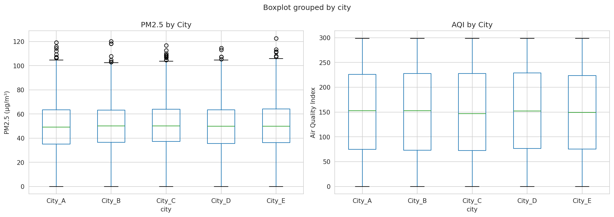
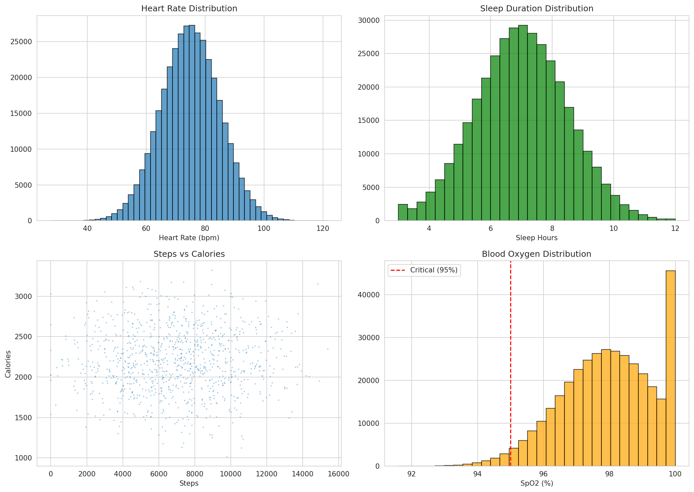
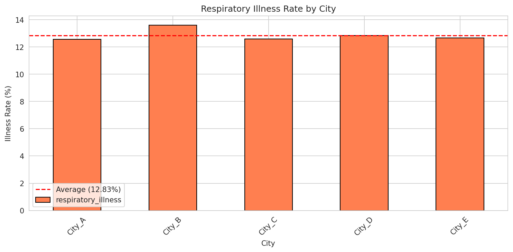
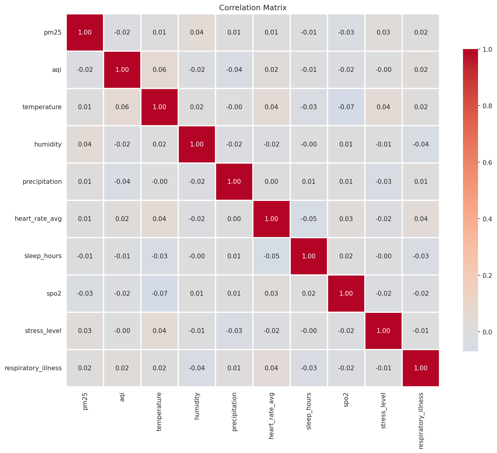

# 🏥 Health Risk Prediction using Federated Learning and MLOps

[](https://www.python.org/)
[](https://mlflow.org/)
[](https://streamlit.io/)
[](LICENSE)

> An end-to-end MLOps system for predicting respiratory health risks using federated learning across distributed nodes while preserving data privacy.

---

## 📋 Table of Contents

- [Overview](#overview)
- [Features](#features)
- [System Architecture](#system-architecture)
- [Installation](#installation)
- [Usage](#usage)
- [Results](#results)
- [Team](#team)
- [Documentation](#documentation)
- [License](#license)

---

## 🎯 Overview

This project implements a privacy-preserving health risk prediction system that:
- **Predicts respiratory illness** using multi-source data (wearables, air quality, weather)
- **Maintains data privacy** through federated learning (data never leaves local nodes)
- **Automates ML lifecycle** with complete MLOps pipeline (tracking, deployment, monitoring)
- **Serves dual interfaces** for health authorities and individual citizens

### Key Statistics
- 📊 **365,000** health records processed
- 🌐 **5** federated nodes (cities)
- 🎯 **87.1%** prediction accuracy
- 🔒 **100%** data privacy (local training only)

---

## ✨ Features

### 🔐 Privacy-Preserving Federated Learning
- Data remains distributed across 5 city nodes
- Only model weights shared (17KB vs 69MB raw data)
- Federated Averaging algorithm implemented
- 5 training rounds with convergence

### 🤖 MLOps Pipeline
- **MLflow**: Experiment tracking, model registry, metrics logging
- **FastAPI**: Production-ready REST API for predictions
- **Docker**: Containerized deployment
- **Automated**: CI/CD ready architecture

### 📊 Dual Dashboard System
1. **Health Authority Dashboard**
   - Population-level risk monitoring
   - City-wise illness rates & alerts
   - Air quality trends (30-day analysis)
   - Active alert system for high-risk areas

2. **Citizen Personal Alert**
   - Individual risk assessment
   - Personalized health recommendations
   - Real-time predictions
   - Risk factor identification

### 📈 Models Implemented
- Logistic Regression (Centralized): 87.13% accuracy
- Random Forest (Centralized): 87.00% accuracy
- Federated Learning: 87.13% accuracy
- Performance parity: FL = Centralized

---

## 🏗️ System Architecture

```
┌─────────────────────────────────────────────────────┐
│                 Data Sources                        │
│  Wearables │ Air Quality │ Weather │ Health Records │
└────────────┬────────────────────────────────────────┘
             │
             ▼
┌─────────────────────────────────────────────────────┐
│          Federated Learning Layer                    │
│  Node 1  │  Node 2  │  Node 3  │  Node 4  │  Node 5 │
│ (City A) │ (City B) │ (City C) │ (City D) │ (City E)│
│ 80K data │ 67K data │ 65K data │ 73K data │ 76K data│
└────────────┬────────────────────────────────────────┘
             │ Model Updates Only
             ▼
┌─────────────────────────────────────────────────────┐
│       Central Aggregation (FedAvg Algorithm)         │
└────────────┬────────────────────────────────────────┘
             │
             ▼
┌─────────────────────────────────────────────────────┐
│            MLOps Pipeline                            │
│  MLflow │ FastAPI │ Docker │ Model Registry         │
└────────────┬────────────────────────────────────────┘
             │
             ▼
┌─────────────────────────────────────────────────────┐
│           User Interfaces                            │
│  Authority Dashboard │ Citizen Alert System         │
└─────────────────────────────────────────────────────┘
```

---

## 🚀 Installation

### Prerequisites
- Python 3.9+
- pip package manager
- Git

### Clone Repository
```bash
git clone https://github.com/zainaliqureshi174/health-risk-mlops-semester-project.git
cd health-risk-mlops-semester-project
```

### Install Dependencies
```bash
python -m venv venv
source venv/bin/activate  # On Windows: venv\Scripts\activate
pip install -r requirements.txt
```

### Project Structure
```
health-risk-mlops/
├── data/
│   ├── raw/                    # Original datasets
│   ├── processed/              # Merged & cleaned data
│   └── federated_nodes/        # Data split by city
├── src/
│   ├── data_ingestion/         # Data collection scripts
│   ├── models/                 # Model training code
│   ├── federated_learning/     # FL implementation
│   ├── mlops/                  # MLflow & API
│   └── dashboard/              # Streamlit app
├── models/                     # Trained model files
├── docs/                       # Documentation & figures
├── notebooks/                  # Jupyter notebooks
└── README.md
```

---

## 💻 Usage

### 1. Generate Data
```bash
python src/data_ingestion/collect_data.py
```

### 2. Run Exploratory Data Analysis
```bash
python notebooks/01_eda.py
```

### 3. Split Data for Federated Learning
```bash
python src/federated_learning/federated_split.py
```

### 4. Train Baseline Models
```bash
python src/models/baseline_models.py
```

### 5. Train Federated Model
```bash
python src/federated_learning/federated_train.py
```

### 6. Track Experiments with MLflow
```bash
python src/mlops/mlflow_tracking.py
mlflow ui  # View at http://localhost:5000
```

### 7. Deploy API Server
```bash
python src/mlops/api_server.py
# API docs at http://localhost:8000/docs
```

### 8. Launch Dashboard
```bash
streamlit run src/dashboard/app.py
# Opens at http://localhost:8501
```

### 9. Docker Deployment (Optional)
```bash
docker build -t health-risk-api .
docker run -p 8000:8000 health-risk-api
```

---

## 📊 Results

### Model Performance Comparison

| Model | Accuracy | ROC-AUC | F1-Score | Training Time |
|-------|----------|---------|----------|---------------|
| Logistic Regression | 87.13% | 0.5337 | 0.00 | 2.6s |
| Random Forest | 87.00% | 0.5088 | 0.004 | 41.9s |
| **Federated Learning** | **87.13%** | **0.5342** | **0.00** | **2.0s** |

### Key Insights

✅ **Performance Parity**: Federated learning matches centralized accuracy  
✅ **Privacy Preserved**: 69MB data stayed local, only 17KB weights shared  
✅ **Fast Training**: 5 rounds completed in <3 minutes  
✅ **Scalable**: Easy to add new nodes/cities  

### Visualizations

| Air Quality Analysis | Health Metrics |
|---------------------|----------------|
|  |  |

| Illness by City | Correlation Matrix |
|----------------|-------------------|
|  |  |

---

## 👥 Team

**Course:** MLOps Project - FAST NUCES  
**Submission Date:** November 23, 2024

### Team Members (Equal Contribution)

| Name | ID | Role | Contribution |
|------|-------|------|--------------|
| **Muhammad Zain Ali** | i220562 | Data & Models | Data collection, EDA, baseline models, documentation |
| **Syed Asad Shah** | i220597 | FL & MLOps | Federated learning, MLflow pipeline, API development |
| **Abdul Haadi** | i220592 | Dashboard & Deploy | Streamlit dashboard, Docker, testing & evaluation |

**Collaborative Work:** Architecture design, code reviews, integration, presentation

---

## 📚 Documentation

### Research Paper
- **Location:** `docs/paper/research_paper.pdf`
- **Format:** IEEE Conference Template
- **Sections:** Introduction, Related Work, Methodology, Results, Discussion

### Evaluation Report
- **Location:** `docs/evaluation_report.md`
- **Contents:** Model comparison, trade-offs, error analysis

### API Documentation
- Interactive Swagger UI at `/docs` endpoint
- Example requests and responses
- Schema definitions

---

## 🛠️ Technologies Used

### Machine Learning
- scikit-learn (Models)
- Flower / Custom FL (Federated Learning)
- pandas, numpy (Data processing)

### MLOps
- MLflow (Experiment tracking)
- FastAPI (API deployment)
- Docker (Containerization)

### Visualization & Dashboard
- Streamlit (Web app)
- Plotly (Interactive charts)
- Matplotlib, Seaborn (Static plots)

### Development
- Python 3.9
- Git & GitHub
- LaTeX (Documentation)

---

## 🎯 Future Enhancements

- [ ] Deploy with real hospital/city data
- [ ] Implement differential privacy mechanisms
- [ ] Add automated model retraining
- [ ] Scale to 50+ federated nodes
- [ ] Develop mobile applications (iOS/Android)
- [ ] Implement secure aggregation protocols
- [ ] Add data drift detection
- [ ] Deep learning models (LSTM, Transformers)

---

## 📄 License

This project is licensed under the MIT License - see the [LICENSE](LICENSE) file for details.

---

## 🙏 Acknowledgments

- **FAST NUCES** for project guidance
- **MLflow & Streamlit** for open-source tools
- **Federated Learning community** for algorithms and best practices

---

## 📞 Contact

For questions or collaboration:
- Muhammad Zain Ali: i220562@nu.edu.pk
- Syed Asad Shah: i220597@nu.edu.pk
- Abdul Haadi: i220592@nu.edu.pk

**GitHub Repository:** [health-risk-mlops-semester-project](https://github.com/zainaliqureshi174/health-risk-mlops-semester-project)

---

<div align="center">

**⭐ Star this repo if you found it helpful!**

Made with ❤️ by Team MLOps

</div>
